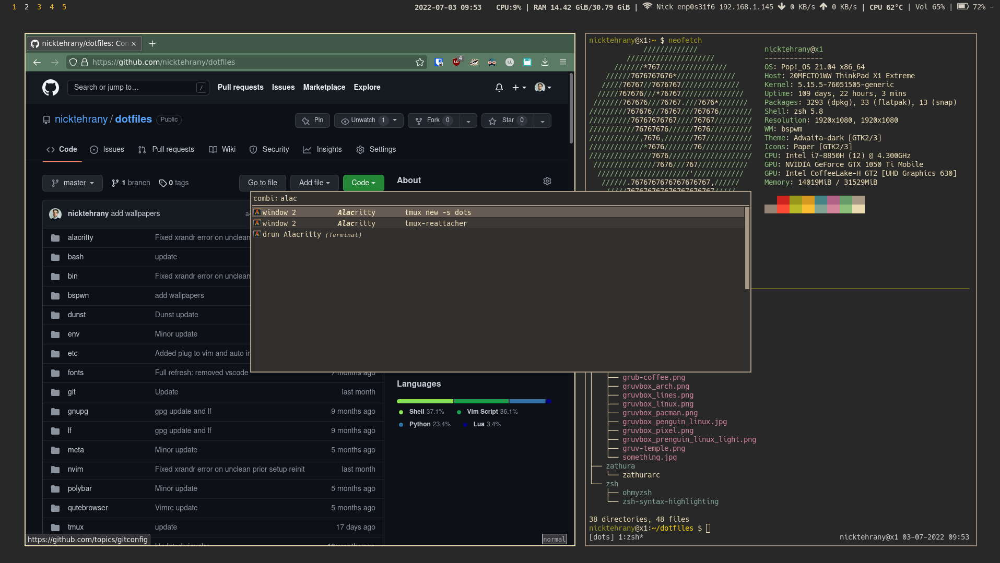

# dotfiles

## Visuals

The current overall look for my shell and other setup (shell theme and so forth can also all be seen in the neofetch output).



## Installation

I use [dotbot](https://github.com/anishathalye/dotbot) for installing and linking all files.

```bash
git clone https://github.com/nicktehrany/dotfiles
cd dotfiles

# For installing the workstation profile (check meta/profiles/)
sudo ./install-profile workstation
```

**Note** all previously linked files will be overwritten, check the `meta/configs/` for symlinks that will be created.

Check the configs from the [workstation profile](meta/profiles/workstation) to see which configs will be installed, which can then
be found in the `meta/configs/` directory.

Lastly, to have the status bar of tmux work correctly run inside tmux `prefix` + `I` to install required plugins via tpm, followed by
reloading tmux with `prefix` + `R`.

### Installing configs manually

To install the configs manually run

```bash
./install-config <config>
```

Check `meta/configs/` for available configs, and configs with `-sudo` in the profile have to be run as sudo (typically package installs that require root). For the vscode config, as I currently don't use it it's not in the workstation profile and therefore won't be installed. Also, when installing vscode, only config files will be linked, installing of vscode and extensions still needs to be done (as this takes quite some time I left it out). But this can easily be run with the vscode installer script

```bash
./vscode/install.sh
```

### Running polybar

Note, my polybar setup is not done yet, therefore it's not yet in the workstation profile, once it's complete it will be added.
I'm using gnome therefore I use the [Hide Top Bar](https://extensions.gnome.org/extension/545/hide-top-bar/) extension for hiding the top bar so that polybar can run on top of it. Then to enable the polybar run

```bash
polybar/launch.sh
```

I'm still working on finishing the polybar and adding something for automatically starting polybar

## Commands

In order to update submodules if their remote repository changes.

```shell
git submodule update --remote --merge
```

### Import custom keyboard shortcuts

The keyboard shortcuts I use are exported in `bin/custom-shortcuts.conf` using

```bash
dconf dump / | sed -n '/\[org.gnome.settings-daemon.plugins.media-keys/,/^$/p' > bin/custom-shortcuts.conf
```

and can be imported again with

```bash
dconf load / < bin/custom-shortcuts.conf
```

## Installing refind boot manager

I use the [refind boot manager](https://www.rodsbooks.com/refind/), with a [theme](https://github.com/EvanPurkhiser/rEFInd-minimal) which I modified, hence it is included in these dotfiles.
Installing it can be done as follows, note this also requires privileges as it is modifying `/boot/EFI`

```bash
# install refind
sudo apt install refind

# create a themes folder for refind (in /boot/EFI/refind)
mkdir themes

# copy the theme in there
cp $HOME/dotfiles/bin/refind/refind-minimal /boot/EFI/refind/themes

# Add theme to the refind config at the end of file(in /boot/EFI/refind/refind.conf)
include themes/refind-minimal/theme.conf
```

## Helpful Commands

Since there are a lot of commands for the different applications, I made a handy [gist](https://gist.github.com/nicktehrany/7126ec0ad18f0af050e15596371ceea5) with the most frequently used commands that I use. This does include some applications that are not mentioned in my dotfiles, and overwritten OS shortcuts.
