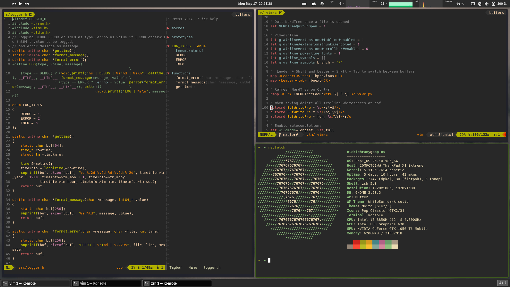

# dotfiles <a href="https://opensource.org/licenses/MIT"> </a> [](https://travis-ci.com/nicktehrany/dotfiles)

## Installation

```bash
git clone https://github.com/nicktehrany/dotfiles
cd dotfiles

# For installing the workstation profile (check meta/profiles/)
./install-profile workstation
```

**Note** all previously linked files will be overwritten, check the `meta/configs/` for symlinks that will be created.

Check the configs from the [workstation profile](meta/profiles/workstation) to see which configs will be installed, which can then
be found in the `meta/configs/` directory.

Next, to set the default konsole theme, open the konsole menu (`Ctrl` + `Shift` + `m`),
under settings select manage profiles, then select `blue_default` and set it as default.
Lastly, to have the status bar of tmux work correctly run inside tmux `prefix` + `I` to install required plugins via tpm, followed by
reloading tmux with `prefix` + `R`.

Next we have to install a font to be able to use nerd font icons in vim. I use the [Hack Regular Nerd Font Mono](https://github.com/ryanoasis/nerd-fonts/blob/master/patched-fonts/Hack/Regular/complete/Hack%20Regular%20Nerd%20Font%20Complete%20Mono.ttf) for this. Just have to download and install it, devicons should then directly work since the font is already set in the konsole config (if using a different font just change the font in the konsole config).

### Installing configs manually

To install the configs manually run

```bash
./install-config <config>
```

This can for example be used for vscode, as I currently don't use it it's not in the workstation profile and therefore won't be installed.
Also, when installing vscode, only config files will be linked, installing of vscode and extensions still needs to be done (as this takes quite some time I left it out). But this can easily be run with the vscode installer script

```bash
./vscode/install.sh
```

### Running polybar

I'm using gnome therefore I use the [Hide Top Bar](https://extensions.gnome.org/extension/545/hide-top-bar/) extension for hiding the top bar so that polybar can run on top of it. Then to enable the polybar run

```bash
polybar/launch.sh
```

I'm still working on finishing the polybar and adding something for automatically starting polybar

## Commands

In order to update submodules if their remote repository changes.

```shell
git submodule update --remote --merge
```

## Helpful Commands

Since there are a lot of commands for the different applications, I made a handy [gist](https://gist.github.com/nicktehrany/7126ec0ad18f0af050e15596371ceea5) with the most frequently used commands that I use. This does include some applications that are not mentioned in my dotfiles, and overwritten OS shortcuts.

## Visuals

The current overall look for my shell and other setup (shell theme and so forth can also all be seen in the neofetch output).


