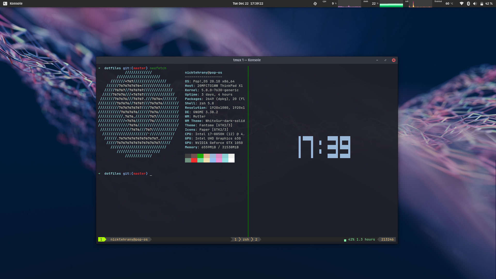

# Dotfiles <a href="https://opensource.org/licenses/MIT"> </a> [](https://travis-ci.com/nicktehrany/dotfiles)

## Requirements

- [polybar](https://github.com/polybar/polybar), can build it from sources or check if the os repo has it

## Installation

```bash
git clone https://github.com/nicktehrany/dotfiles
cd dotfiles
sudo ./install
```

I currently don't use vscode so the install is disabled, but if you want to install vscode along with all the extensions run
```bash
./vscode/install.sh
```

Check the [.travis.yml](https://github.com/nicktehrany/dotfiles/blob/master/.travis.yml) for packages that will be installed,
if not already installed. **All existing links or config files will be overwritten!** (Check [.install.conf.yaml](https://github.com/nicktehrany/dotfiles/blob/master/install.conf.yaml) for all links)

Then just open a new konsole. The updating and installing of submodules and vscode plugins will take a few minutes.

Next, to set the default konsole theme, open the konsole menu (`Ctrl` + `Shift` + `m`),
under settings select manage profiles, then select `blue_default` and set it as default.
Lastly, to have the status bar of tmux work correctly run inside tmux `prefix` + `I` to install required plugins via tpm, followed by
reloading tmux with `prefix` + `R`.

Next we have to install a font to be able to use nerd font icons in vim. I use the [Hack Regular Nerd Font Mono](https://github.com/ryanoasis/nerd-fonts/blob/master/patched-fonts/Hack/Regular/complete/Hack%20Regular%20Nerd%20Font%20Complete%20Mono.ttf) for this. Just have to download and install it, devicons should then directly work since the font is already set in the konsole config (if using a different font just change the font in the konsole config).

I'm using gnome therefore I use the [Hide Top Bar](https://extensions.gnome.org/extension/545/hide-top-bar/) extension for hidin the top bar so that polybar can run on top of it. Then to enable the polybar run

```bash
polybar/launch.sh
```

I'm still working on finishing the polybar and adding something for automatically starting polybar

## Commands

In order to update submodules if their remote repository changes.

```shell
git submodule update --remote --merge
```

If you only want to relink config files or run all commands except shell (in the [.install.conf.yaml](https://github.com/nicktehrany/dotfiles/blob/master/install.conf.yaml) file)

```shell
./install --only link # or
./install --except shell
```

## Helpful Commands

Since there are a lot of commands for the different applications, I made a handy [gist](https://gist.github.com/nicktehrany/7126ec0ad18f0af050e15596371ceea5) with the most frequently used commands that I use. This does include some applications that are not mentioned in my dotfiles, and overwritten OS shortcuts.

## Visuals

The current overall look for my shell and other setup (shell theme and so forth can also all be seen in the neofetch output).


### VS Code

My vscode is still a work in progress as far as the right color scheme goes. Thus far it looks as follows,


If you want to play around with different colors, adjust workbench.colorCustomizations in the [settings.json](https://github.com/nicktehrany/dotfiles/blob/master/vscode/settings.json) file, and possibly add more of the vscode color variables you can set. A nicely compiled list of
these can be found [here](https://gist.github.com/lol-russo/1c7a0b958be4b9434c5a120f24d5e7c3).
