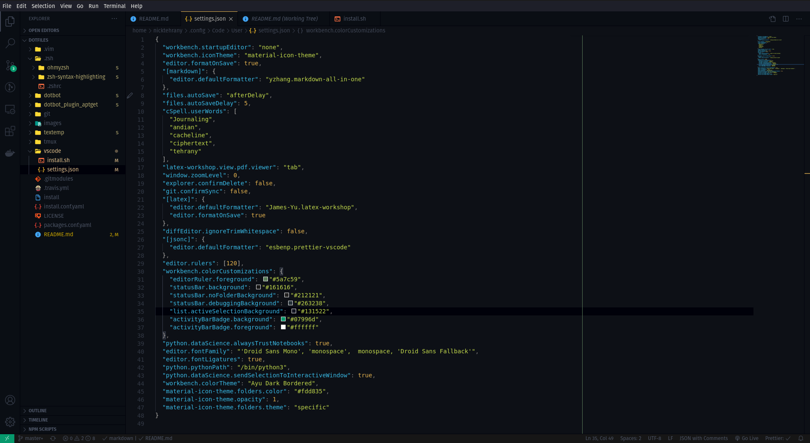

# Dotfiles <a href="https://opensource.org/licenses/MIT"> </a> [](https://travis-ci.com/nicktehrany/dotfiles)

## Installation

Use at **OWN RISK**, the build pipeline runs a linux focal vm with all required packages already installed. Check the [.travis.yml](https://github.com/nicktehrany/dotfiles/blob/master/.travis.yml) for packages that will be installed, if not already installed. All existing links or config files will be overwritten! (Check [.install.conf.yaml](https://github.com/nicktehrany/dotfiles/blob/master/install.conf.yaml) for all links)

```shell
git clone https://github.com/nicktehrany/dotfiles
cd dotfiles
./install
```

Then just open a new terminal. The updating of submodules can sometimes take a couple of seconds.<!--  -->

## Commands

In order to update submodules if their remote repository changes.

```shell
git submodule update --remote --merge
```

If you only want to relink config files or run all commands except shell (in the [.install.conf.yaml](https://github.com/nicktehrany/dotfiles/blob/master/install.conf.yaml) file)

```shell
./install --only link # or
./install --except shell
```

## Visuals

The current overall look for my shell and other setup (shell theme and so forth can also all be seen in the neofetch output).  


## VS Code

My vscode is still a work in progress as far as the right color scheme goes. Thus far it looks as follows,


If you want to play around with different colors, adjust workbench.colorCustomizations in the [settings.json](https://github.com/nicktehrany/dotfiles/blob/master/vscode/settings.json) file, and possibly add more of the vscode color variables you can set. A nicely compiled list of
these can be found [here](https://gist.github.com/lol-russo/1c7a0b958be4b9434c5a120f24d5e7c3).

## Credits

Credits to [dotbot](https://github.com/anishathalye/dotbot/tree/043373ea74f85ff3c55a9c9f4eeb13ad7d694e71) for making
setting up of dotfiles this simple, and the handy [aptget](https://github.com/dein0s/dotbot_plugin_aptget) plugin for
installing required packages.
